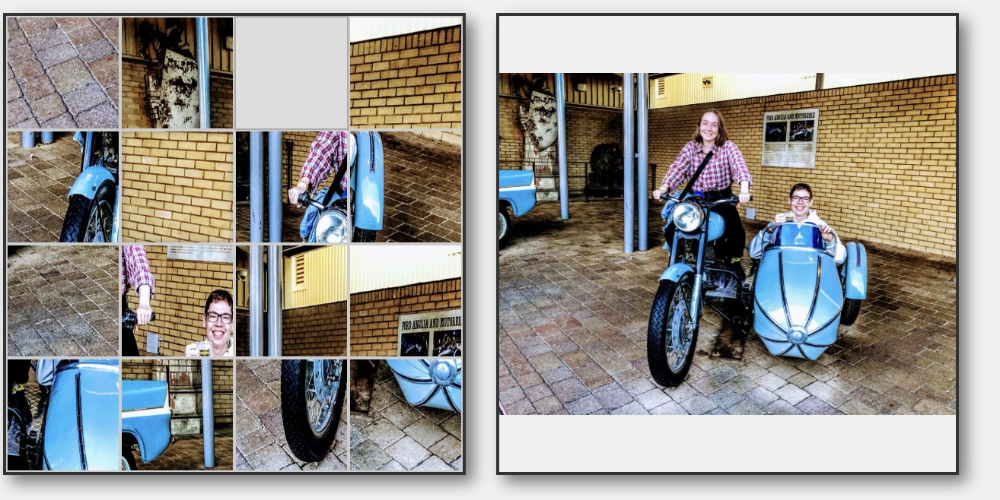

# Schiebepuzzle / Sliding Puzzle / Puzzle Scorrevole

## Deutsch 🇩🇪

### Beschreibung
Dieses Projekt beinhaltet zwei verschiedene Implementierungen eines klassischen Schiebepuzzles:
- Eine Desktop-Version in Python mit Tkinter
- Eine Webversion in HTML, CSS und JavaScript

In beiden Versionen kann der Benutzer ein eigenes Bild als Puzzlevorlage verwenden und ganze Reihen oder Spalten verschieben, um das Puzzle zu lösen.

### Features
- **Bildbasiertes Puzzle**: Verwende dein eigenes JPEG-Bild als Puzzlevorlage
- **Reihen/Spalten-Bewegung**: Verschiebe ganze Reihen oder Spalten auf einmal
- **Lösbarkeits-Garantie**: Alle generierten Puzzles sind garantiert lösbar
- **Referenzbild**: Anzeige des vollständigen Originalbildes als Referenz
- **Responsive Design** (HTML-Version): Angepasst für Desktop- und Mobilgeräte

### Verwendung

#### Python-Version:
1. Platziere eine JPEG-Datei im selben Verzeichnis wie `Puzzle.py`
2. Führe das Skript aus: `python Puzzle.py`
3. Das Programm lädt automatisch die erste gefundene JPEG-Datei

#### HTML-Version:
1. Öffne `puzzle.html` in einem Browser
2. Das Programm versucht automatisch, eine Datei namens `puzzle_image.jpg` zu laden
3. Alternativ kannst du über den Upload-Button ein eigenes Bild auswählen

### Anforderungen
- Python-Version: Python 3.x und Pillow-Bibliothek (`pip install Pillow`)
- HTML-Version: Moderner Webbrowser mit JavaScript-Unterstützung

---

## English 🇬🇧

### Description
This project includes two different implementations of a classic sliding puzzle:
- A desktop version in Python using Tkinter
- A web version using HTML, CSS, and JavaScript

In both versions, users can use their own image as the puzzle template and move entire rows or columns to solve the puzzle.

### Features
- **Image-based puzzle**: Use your own JPEG image as the puzzle template
- **Row/Column movement**: Move entire rows or columns at once
- **Solvability guarantee**: All generated puzzles are guaranteed to be solvable
- **Reference image**: Display of the complete original image for reference
- **Responsive design** (HTML version): Adapted for desktop and mobile devices

### Usage

#### Python Version:
1. Place a JPEG file in the same directory as `Puzzle.py`
2. Run the script: `python Puzzle.py`
3. The program automatically loads the first JPEG file found

#### HTML Version:
1. Open `puzzle.html` in a browser
2. The program automatically tries to load a file named `puzzle_image.jpg`
3. Alternatively, you can select your own image using the upload button

### Requirements
- Python version: Python 3.x and Pillow library (`pip install Pillow`)
- HTML version: Modern web browser with JavaScript support

---

## Italiano 🇮🇹

### Descrizione
Questo progetto include due diverse implementazioni del classico puzzle scorrevole:
- Una versione desktop in Python con Tkinter
- Una versione web in HTML, CSS e JavaScript

In entrambe le versioni, l'utente può utilizzare una propria immagine come modello per il puzzle e spostare intere righe o colonne per risolverlo.

### Caratteristiche
- **Puzzle basato su immagini**: Utilizza la tua immagine JPEG come modello per il puzzle
- **Movimento di righe/colonne**: Sposta intere righe o colonne contemporaneamente
- **Garanzia di risolvibilità**: Tutti i puzzle generati sono garantiti risolvibili
- **Immagine di riferimento**: Visualizzazione dell'immagine originale completa come riferimento
- **Design responsive** (versione HTML): Adattato per dispositivi desktop e mobili

### Utilizzo

#### Versione Python:
1. Posiziona un file JPEG nella stessa directory di `Puzzle.py`
2. Esegui lo script: `python Puzzle.py`
3. Il programma carica automaticamente il primo file JPEG trovato

#### Versione HTML:
1. Apri `puzzle.html` in un browser
2. Il programma tenta di caricare automaticamente un file chiamato `puzzle_image.jpg`
3. In alternativa, puoi selezionare una tua immagine tramite il pulsante di caricamento

### Requisiti
- Versione Python: Python 3.x e libreria Pillow (`pip install Pillow`)
- Versione HTML: Browser web moderno con supporto JavaScript